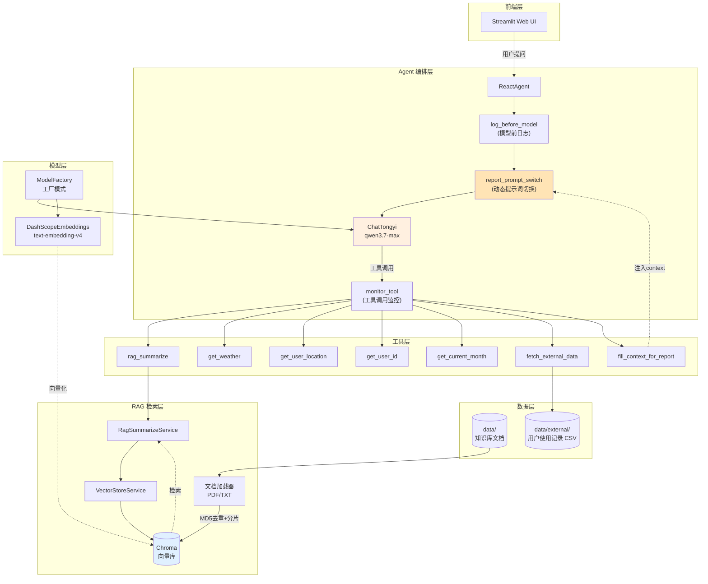
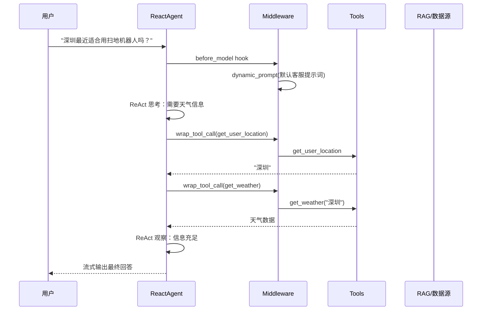
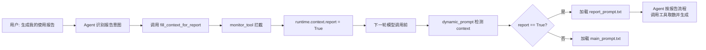

# 智扫通 · 扫地机器人智能客服 Agent

> 基于 LangChain 1.x 新版 Agent API + ReAct 推理范式 + RAG 检索增强的垂直领域智能客服系统。
> 支持多场景工具编排、动态提示词切换、流式输出，覆盖售前咨询、故障排查、个性化使用报告生成等核心客服场景。

---

## 目录

- [项目背景](#项目背景)
- [核心特性](#核心特性)
- [系统架构](#系统架构)
- [技术选型说明](#技术选型说明)
- [项目结构](#项目结构)
- [快速开始](#快速开始)
- [使用示例](#使用示例)
- [配置说明](#配置说明)
- [路线图](#路线图)

---

## 项目背景

扫地机器人品类存在「售前选购决策复杂 + 售后使用问题专业 + 用户使用数据难以洞察」三大客服痛点。本项目以 ReAct Agent 为核心，结合垂直知识库 RAG 与用户使用记录检索，构建一个能「思考-行动-观察」的智能客服：

- **售前咨询**：基于私有知识库（产品手册、100 问、故障排除等）的精准 RAG 问答
- **场景适配**：结合用户所在城市实时天气，给出适配的机器人使用建议
- **个性化报告**：根据用户使用记录生成结构化使用情况报告与保养建议

---

## 核心特性

### 1. ReAct Agent + 多工具编排
基于 LangChain 1.x 新版 `create_agent` API，封装 7 个垂直工具（RAG 检索、天气查询、用户信息、报告数据等），Agent 自主决策调用链路。

### 2. Middleware 中间件机制（核心亮点）
使用 LangChain 新版 middleware API 实现三类横切关注点：

| 中间件 | 装饰器 | 作用 |
|---|---|---|
| `monitor_tool` | `@wrap_tool_call` | 工具调用前后日志监控、异常捕获、运行时上下文注入 |
| `log_before_model` | `@before_model` | 模型调用前打印消息历史，便于调试多轮推理 |
| `report_prompt_switch` | `@dynamic_prompt` | **基于 runtime context 动态切换系统提示词**，实现「客服问答」与「报告生成」两套提示词的无缝切换 |

### 3. 完整 RAG 链路
- 文档加载（PDF / TXT 双格式）
- 文件 MD5 去重，避免重复入库
- `RecursiveCharacterTextSplitter` 递归分片（按中文标点智能切分）
- Chroma 向量库持久化
- 检索 + 总结 Chain（Prompt | Model | Parser）

### 4. 工程化设计
- **配置驱动**：所有参数（模型、向量库、分片策略、提示词路径）通过 YAML 配置
- **工厂模式**：`BaseModelFactory` 抽象基类统一管理 ChatModel / Embeddings 实例化
- **统一日志**：按日期分文件、控制台 + 文件双输出、DEBUG/INFO 分级
- **统一路径管理**：`get_abs_path` 解决相对路径在不同启动目录下的歧义

### 5. 流式输出
基于 `agent.stream(stream_mode="values")` 实现真正的逐 token 流式响应，前端 Streamlit `write_stream` 逐字符渲染。

---

## 系统架构

### 整体架构图



### ReAct 推理流程



### 报告生成场景的提示词切换



---

## 技术选型说明

| 层级 | 技术 | 版本 | 选型理由 |
|---|---|---|---|
| **Agent 框架** | LangChain | 1.3.11 | 选用 1.x 新版 API（`create_agent` + middleware），相比旧版 `AgentExecutor` 提供更细粒度的生命周期 hook，支持动态提示词、工具监控等横切关注点的解耦实现 |
| **状态机引擎** | LangGraph | 1.2.6 | LangChain 1.x 底层依赖，提供 `Runtime` 上下文与 `context` 透传能力，是动态提示词切换的技术基础 |
| **LLM** | 通义千问 qwen3.7-max | - | 中文场景表现优秀，DashScope API 稳定，原生支持工具调用 |
| **Embeddings** | text-embedding-v4 | - | 阿里最新版向量模型，中文检索效果好，与 LLM 同生态便于统一管理 |
| **向量数据库** | Chroma | 1.5.9 | 轻量级、嵌入式部署、原生支持持久化，适合中小规模知识库（百万级以下 chunk）的开发与验证场景 |
| **文档加载** | PyPDFLoader / TextLoader | - | LangChain 原生集成，支持 PDF 文本提取与中文 TXT 编码兼容 |
| **文本分片** | RecursiveCharacterTextSplitter | - | 按分隔符优先级递归切分（`\n\n` → `\n` → 中文标点 → 空格），保证语义完整性 |
| **Web UI** | Streamlit | 1.58.0 | 数据应用快速原型工具，内置 `chat_input` / `write_stream` 组件，适合 Agent 类应用的对话式交互 |

### 关键设计决策

**Q：为什么用 middleware 而不是直接在 Agent 主流程里写日志/切换逻辑？**
A：Middleware 实现了业务逻辑与横切关注点的解耦。`report_prompt_switch` 这类动态提示词切换如果硬编码在主流程中，会导致 Agent 类臃肿且难以扩展。通过 `@dynamic_prompt` 装饰器，提示词策略可以独立演进（未来可扩展更多场景的提示词切换），而 Agent 本身只关心工具编排。

**Q：为什么用文件 MD5 做知识库去重？**
A：知识库迭代过程中，避免重复入库同一份文档导致检索结果冗余。MD5 计算成本低（4KB 分块流式读取避免大文件爆内存），持久化到 `md5.text` 文件，重启后仍生效。

**Q：为什么用工厂模式封装模型？**
A：未来可能切换到 OpenAI / 本地模型 / 其他厂商。工厂模式将模型实例化逻辑收敛到 `ModelFactory`，切换时只需新增 Factory 子类，调用方无感知。

---

## 项目结构

```
py_ai/
├── app.py                          # Streamlit 入口，对话 UI + 流式输出
├── requirements.txt                # 依赖清单
├── agent/                          # Agent 编排层
│   ├── react_agent.py              # ReactAgent 封装
│   └── tools/
│       ├── agent_tools.py          # 7 个工具定义（@tool 装饰器）
│       └── middleware.py           # 3 个中间件（监控/日志/动态提示词）
├── rag/                            # RAG 检索层
│   ├── rag_service.py              # 检索 + 总结 Chain
│   └── vector_store.py             # Chroma 向量库 + 文档加载
├── model/
│   └── factory.py                  # 模型工厂（ChatModel / Embeddings）
├── utils/                          # 基础设施
│   ├── config_handler.py           # YAML 配置加载
│   ├── prompt_loader.py            # 提示词文件加载
│   ├── file_handler.py             # 文件 MD5 / PDF / TXT 加载
│   ├── logger_handler.py           # 统一日志器
│   └── path_tool.py                # 绝对路径管理
├── config/                         # YAML 配置
│   ├── rag.yml                     # 模型名称
│   ├── chroma.yml                  # 向量库与分片参数
│   ├── prompts.yml                 # 提示词文件路径
│   └── agent.yml                   # Agent 业务配置
├── prompts/                        # 提示词模板
│   ├── main_prompt.txt             # 客服主提示词（ReAct 准则）
│   ├── rag_summarize.txt           # RAG 总结提示词
│   └── report_prompt.txt           # 报告生成专用提示词
├── data/                           # 数据
│   ├── *.txt / *.pdf               # 知识库源文档
│   └── external/
│       └── records.csv             # 用户使用记录（外部数据源）
├── chroma_db/                      # Chroma 持久化目录（自动生成）
├── logs/                           # 日志目录（自动生成）
└── md5.text                        # 已入库文件的 MD5 记录（自动生成）
```

---

## 快速开始

### 环境要求

- Python ≥ 3.11
- 阿里云 DashScope API Key（用于通义千问 + 向量化模型）

### 1. 克隆并创建虚拟环境

```bash
git clone <your-repo-url>
cd py_ai

python -m venv .venv
# Windows
.venv\Scripts\activate
# macOS / Linux
source .venv/bin/activate
```

### 2. 安装依赖

```bash
pip install -r requirements.txt
```

### 3. 配置环境变量

DashScope API Key 通过环境变量注入（`langchain_community` 的通义千问集成默认读取 `DASHSCOPE_API_KEY`）：

```bash
# Windows PowerShell
$env:DASHSCOPE_API_KEY = "sk-xxxxxxxxxxxxxxxxxxxx"

# macOS / Linux
export DASHSCOPE_API_KEY="sk-xxxxxxxxxxxxxxxxxxxx"
```

### 4. 初始化知识库向量库（首次运行必做）

将知识库文档（PDF/TXT）放入 `data/` 目录后，执行：

```bash
python -m rag.vector_store
```

执行后会看到日志输出：

```
[加载知识库]data/扫地机器人100问.pdf 内容加载成功
[加载知识库]data/故障排除.txt 内容加载成功
...
```

向量库会持久化到 `chroma_db/` 目录，后续启动无需重复初始化（除非新增文档）。

### 5. 启动 Web 应用

```bash
streamlit run app.py
```

浏览器访问 `http://localhost:8501` 即可开始对话。

---

## 使用示例

### 场景一：售前 RAG 问答

```
用户：小户型适合哪些扫地机器人？
Agent：[调用 rag_summarize("小户型 扫地机器人 选购")]
       基于知识库检索结果，给出小户型选购建议...
```

### 场景二：环境适配咨询（多工具编排）

```
用户：深圳最近适合用扫地机器人吗？
Agent：[思考] 需要先获取用户位置和天气
       [调用 get_user_location] → 深圳
       [调用 get_weather("深圳")] → 天气数据
       [观察] 信息充足，整合回答
       基于深圳当前天气（晴天、湿度50%、AQI21）...
```

### 场景三：个性化报告生成（动态提示词切换）

```
用户：给我生成我的使用报告
Agent：[识别报告意图]
       [调用 fill_context_for_report] → 中间件注入 context.report=True
       [下一轮] dynamic_prompt 切换到 report_prompt.txt
       [调用 get_user_id] → 1003
       [调用 get_current_month] → 2025-06
       [调用 fetch_external_data("1003", "2025-06")] → 使用记录
       [生成 Markdown 报告]
```

---

## 配置说明

### `config/rag.yml` — 模型配置

```yaml
chat_model_name: qwen3.7-max           # 对话模型
embedding_model_name: text-embedding-v4 # 向量化模型
```

### `config/chroma.yml` — 向量库与分片

```yaml
collection_name: agent                 # 集合名
persist_directory: chroma_db           # 持久化目录
k: 3                                   # 检索 top-k
data_path: data                        # 知识库源目录
md5_hex_store: md5.text                # MD5 去重记录文件
allow_knowledge_file_type: ["txt", "pdf"]

chunk_size: 200                        # 分片大小（字符数）
chunk_overlap: 20                      # 分片重叠
separators: ["\n\n", "\n", ".", "!", "?", "。", "！", "？", " ", ""]
```

### `config/prompts.yml` — 提示词路径

```yaml
main_prompt_path: prompts/main_prompt.txt              # 客服主提示词
rag_summarize_prompt_path: prompts/rag_summarize.txt   # RAG 总结提示词
report_prompt_path: prompts/report_prompt.txt          # 报告生成提示词
```

### `config/agent.yml` — Agent 业务配置

```yaml
external_data_path: data/external/records.csv          # 用户使用记录路径
```

---

## 路线图

- [ ] **真实 API 接入**：`get_weather` 接入和风天气 API，替换当前 mock 数据
- [ ] **数据源升级**：`fetch_external_data` 改为 SQLite/MySQL 查询，支持更大规模数据
- [ ] **FastAPI 服务化**：将 Agent 能力封装为 REST API，支持前端解耦部署
- [ ] **多轮对话上下文管理**：消息窗口截断 + 历史摘要压缩，避免 token 溢出
- [ ] **可观测性**：接入 LangSmith / LangFuse，记录 trace 与工具调用链
- [ ] **评测体系**：构造测试集，统计检索召回率、回答准确率、平均响应时延
- [ ] **Docker 化**：`docker-compose` 一键启动应用 + 向量库
- [ ] **多 Agent 协作**：拆分售前推荐 Agent 与售后诊断 Agent

---

## License

MIT
